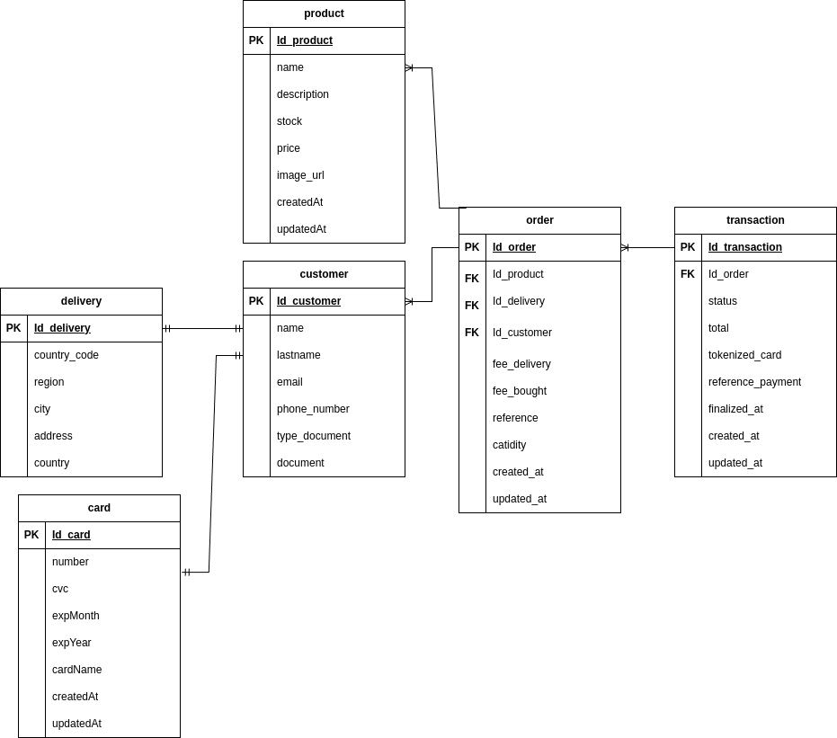

# test-mini-commerce
This respository you will see the mini commerce manage like show product pay for product you can will see the summary and different states of transaction for this example is handler by wompi payments for developers

